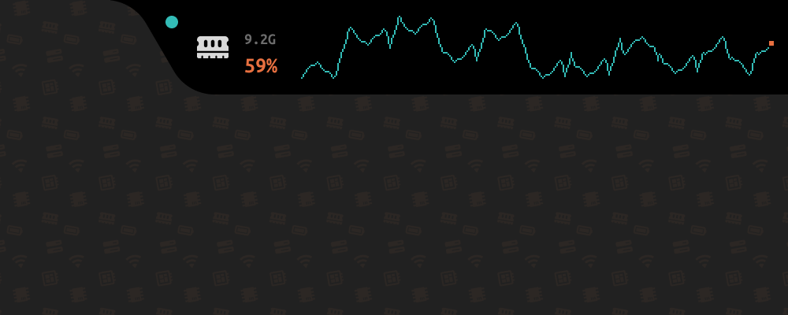
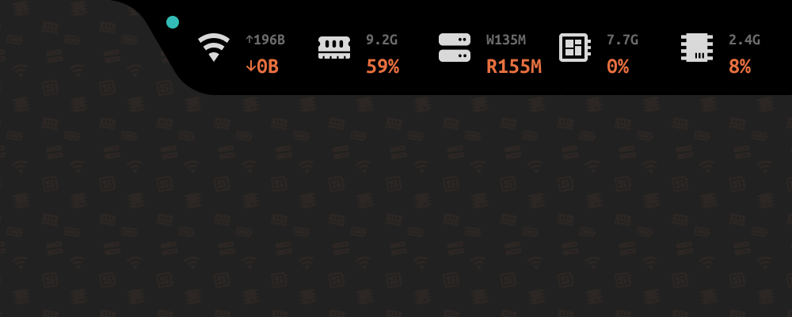

# DAEMONITOR

[English](#english) | [中文](#中文)

---

## English

A real-time system performance monitoring overlay for Windows.


### Overview

Daemonitor is a lightweight system monitoring overlay that displays real-time hardware metrics at the top edge of the screen. It tracks CPU, GPU, RAM, Network, and Disk performance with an auto-hiding overlay and smooth animation. Designed for power users, gamers, and developers who need at-a-glance system insight without leaving their workflow.

### Features

- Real-time monitoring of CPU, GPU, RAM, Network, and Disk I/O
- Direct2D rendered overlay with auto-hide animation (peek at screen top edge)
- Left/Right anchor positioning via system tray
- Chart mode with line-graph visualization for each metric
- Dual-line chart for Network (Rx/Tx) and Disk (Read/Write)
- Battery status indicator
- Adjustable polling rate (0.25 s, 0.5 s, 1 s, 2 s)
- Settings persisted to Windows Registry
- Startup with Windows option
- Single-file portable executable (~700 KB)
- No runtime file dependencies — fonts and icons compiled into the binary

### System Tray Menu

Left-click or right-click the system tray icon to access settings:

| Menu | Description |
|------|-------------|
| **Polling** | Set data refresh interval (0.25 s / 0.5 s / 1 s / 2 s) |
| **Position** | Anchor overlay to Top Left or Top Right |
| **Auto-hide** | Toggle auto-hide behavior (peek at screen top edge) |
| **Startup with Windows** | Launch Daemonitor automatically on login |
| **Chart** | Switch to chart mode for a single metric, or turn Off for 5-slot view |
| **Exit** | Close the application |

### Chart Metrics

| Metric | Type | Lines | Line 1 Color | Line 2 Color |
|--------|------|-------|-------------|-------------|
| CPU | Percentage | Single | `#33BCB7` | — |
| GPU | Percentage | Single | `#33BCB7` | — |
| NET | Bandwidth | Dual | `#33BCB7` (Rx↓) | `#0A2625` (Tx↑) |
| RAM | Percentage | Single | `#33BCB7` | — |
| SSD | Bandwidth | Dual | `#33BCB7` (Read) | `#0A2625` (Write) |

### Quick Start

1. Download `Daemonitor-{version}.exe` from the [Releases]() page
2. Run — no installation required
3. Move the cursor to the top edge of the screen to peek at the overlay
4. Right-click or left-click the tray icon to configure

### Preview





### Versioning

This project follows [Semantic Versioning 2.0.0](https://semver.org/) with custom lifecycle stages:

| Stage | Format | Audience |
|-------|--------|----------|
| Experimental | x.y.z-experimental.N | Core developers |
| Development | x.y.z-dev.N | Internal developers |
| Integration | x.y.z-integration.N | QA team |
| Preview | x.y.z-preview.N | Beta users |
| Candidate | x.y.z-candidate.N | Release participants |
| Release | x.y.z | Production users |

### Build from Source

```bash
# Requires CMake 3.24+ and MinGW-w64 GCC or MSVC
cmake -B build -G Ninja
cmake --build build
```

### License

MIT License.

---

## 中文

一款适用于 Windows 的实时系统性能监控覆盖窗口。


### 简介

Daemonitor 是一款轻量级系统监控覆盖工具，在屏幕顶部边缘实时显示硬件性能指标。它追踪 CPU、GPU、内存、网络和磁盘性能，支持自动隐藏和流畅动画。专为需要一目了然系统状态的高级用户、游戏玩家和开发者设计。

### 功能特性

- 实时监控 CPU、GPU、内存、网络和磁盘 I/O
- Direct2D 渲染覆盖窗口，支持自动隐藏动画（鼠标移至屏幕顶部边缘唤出）
- 通过系统托盘切换左侧/右侧锚点位置
- 曲线图模式，可对每个指标绘制折线图
- 网络（下载/上传）和磁盘（读/写）支持双线图表
- 电池电量指示灯
- 可调采样频率（0.25 s / 0.5 s / 1 s / 2 s）
- 设置持久化到 Windows 注册表
- 开机自启动选项
- 单文件便携可执行程序（约 700 KB）
- 无运行时文件依赖——字体和图标编译进二进制文件

### 系统托盘菜单

左键或右键点击系统托盘图标访问设置：

| 菜单项 | 说明 |
|--------|------|
| **Polling** | 设置数据刷新间隔（0.25 s / 0.5 s / 1 s / 2 s） |
| **Position** | 将覆盖窗口锚定到左上角或右上角 |
| **Auto-hide** | 切换自动隐藏行为（鼠标移至屏幕顶部唤出） |
| **Startup with Windows** | 登录时自动启动 Daemonitor |
| **Chart** | 切换到指定指标的曲线图模式，或选择 Off 返回 5 槽视图 |
| **Exit** | 关闭应用程序 |

### 曲线图指标

| 指标 | 类型 | 线数 | 线 1 颜色 | 线 2 颜色 |
|------|------|------|----------|----------|
| CPU | 百分比 | 单线 | `#33BCB7` | — |
| GPU | 百分比 | 单线 | `#33BCB7` | — |
| NET | 带宽 | 双线 | `#33BCB7`（下载） | `#0A2625`（上传） |
| RAM | 百分比 | 单线 | `#33BCB7` | — |
| SSD | 带宽 | 双线 | `#33BCB7`（读） | `#0A2625`（写） |

### 快速开始

1. 从 [Releases]() 页面下载 `Daemonitor-{version}.exe`
2. 直接运行——无需安装
3. 将鼠标移至屏幕顶部边缘唤出监控覆盖窗口
4. 右键或左键点击系统托盘图标进行配置

### 预览


### 版本规范

本项目遵循 [语义化版本 2.0.0](https://semver.org/)，并使用自定义生命周期阶段：

| 阶段 | 格式 | 受众 |
|------|------|------|
| Experimental（实验） | x.y.z-experimental.N | 核心开发者 |
| Development（开发） | x.y.z-dev.N | 内部开发者 |
| Integration（集成） | x.y.z-integration.N | QA 团队 |
| Preview（预览） | x.y.z-preview.N | 公测用户 |
| Candidate（候选） | x.y.z-candidate.N | 发布参与者 |
| Release（正式） | x.y.z | 生产用户 |

### 从源码构建

```bash
# 需要 CMake 3.24+ 和 MinGW-w64 GCC 或 MSVC
cmake -B build -G Ninja
cmake --build build
```

### 许可证

MIT 许可证。

---
